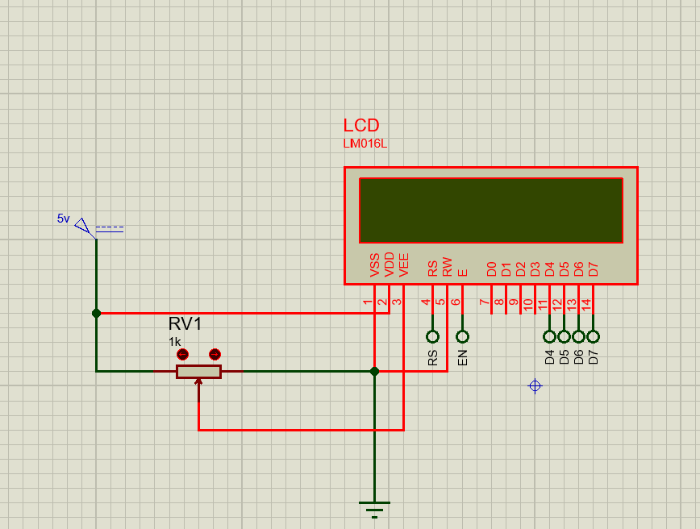
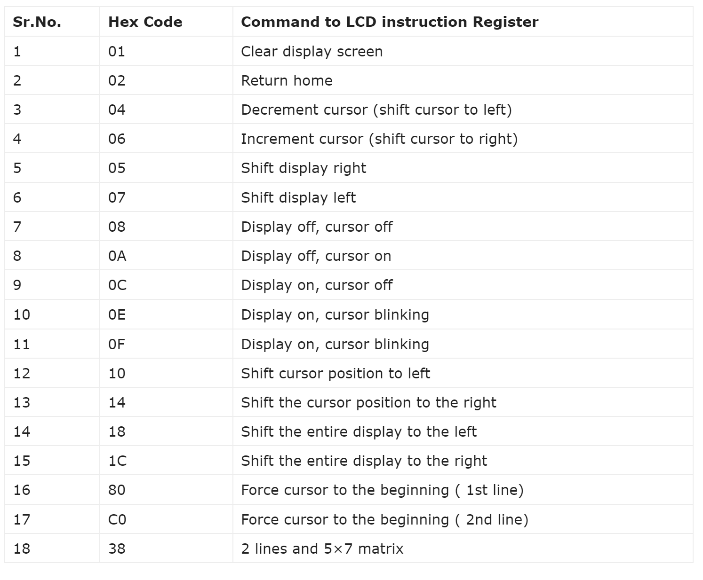

## Interfacing 16×2 LCD with STM32
this is Interfacing 16×2 LCD with bluePill board but you can use in all stm32 microcontroller.
just add lcd.h and lcd.c to your project.

## Wiering
| STM32 GPIO        | LCD pin       |
| ----------------- | ------------- |
| GPIOA0            | RS            |
| GPIOA1            | EN            |
| GPIOA2 : GPIOA5   | D4 : D7       |



## Describe code
``` c
LCD_Init(); //: is for Initialization'
LCD_SendCommand(uint8_t command); //: is for sending command'
LCD_WriteString(char* str); //: is for printing data on LCD'
LCD_Clear(); //: is for clearing LCD screen'
```

## list of command
